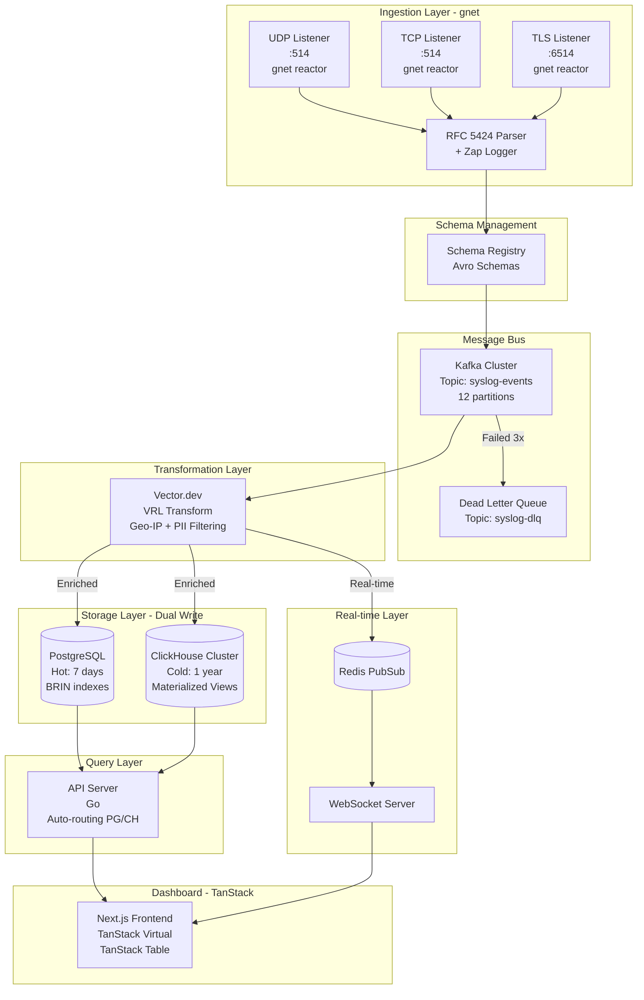

# Design: Syslog Server - Production-Ready Architecture

> **Kiến trúc Production từ đầu**: Kafka + ClickHouse + Schema Registry

## 1. Architecture Overview

### 1.1 High-Level System Diagram



### 1.2 Design Philosophy

**Tách biệt trách nhiệm (Separation of Concerns):**
- Ingestion ≠ Storage ≠ Query
- Mỗi layer có thể scale độc lập
- Failure ở một layer không crash toàn hệ thống

**Event Sourcing + CQRS:**
- Write path: Receivers → Kafka (append-only log)
- Read path: API queries PG (hot) hoặc CH (cold)
- Kafka là "single source of truth"

## 2. Component Breakdown

### 2.1 Syslog Receivers (Go with gnet)

**Responsibilities:**
- Listen trên 3 protocols (UDP/TCP/TLS)
- Parse RFC 5424 format
- Validate và serialize thành Avro
- Send to Kafka với partitioning strategy

**Technology Choices:**
- **Networking**: `gnet` (event-driven framework)
  - **Lý do chọn gnet**:
    - epoll/kqueue thay vì goroutine-per-connection
    - Handle hàng triệu concurrent connections
    - Memory footprint cực thấp (< 1KB per connection)
    - Tránh context switch overhead
  - **Architecture**: Multiple Reactors pattern
    - Main reactor: Accept connections
    - Sub reactors (N workers): Handle I/O events
- **Logging**: `Zap` (Uber) cho internal logging
  - Zero-allocation design
  - Sub-microsecond latency
  - Giảm GC pressure đáng kể
- **Parser**: `go-syslog` library
- **Kafka Client**: `github.com/confluentinc/confluent-kafka-go`
- **Avro**: `github.com/linkedin/goavro`

**gnet Implementation Example:**

```go
package main

import (
    "github.com/panjf2000/gnet/v2"
    "go.uber.org/zap"
)

type syslogServer struct {
    gnet.BuiltinEventEngine
    logger        *zap.Logger
    kafkaProducer KafkaProducer
    reactor       int
}

func (s *syslogServer) OnTraffic(c gnet.Conn) gnet.Action {
    // Read syslog message from connection
    buf, _ := c.Next(-1)
    
    // Parse RFC 5424 (non-blocking)
    msg, err := ParseSyslog(buf)
    if err != nil {
        s.logger.Error("parse failed", zap.Error(err))
        return gnet.None
    }
    
    // Send to Kafka asynchronously
    s.kafkaProducer.SendAsync(msg)
    
    return gnet.None
}

func main() {
    logger, _ := zap.NewProduction()
    server := &syslogServer{
        logger:   logger,
        reactor:  runtime.NumCPU(),
    }
    
    // Start UDP listener
    gnet.Run(server, "udp://:514", 
        gnet.WithMulticore(true), 
        gnet.WithNumEventLoop(server.reactor))
}
```

**Concurrency Model:**
```
Client Connections → gnet Reactor Pool (N workers)
                     ↓
                  Parse Buffer (zero-copy)
                     ↓
                  Kafka Producer (async)
```

**Partitioning Strategy:**
- Partition key: `hostname`
- Lý do: Đảm bảo causal ordering per host
- Trade-off: Có thể gặp hot partition nếu 1 host spam

### 2.2 Apache Kafka

**Configuration:**
- **Cluster size**: 3 brokers
- **Topic**: `syslog-events`
  - Partitions: 12 (có thể scale đến 24)
  - Replication factor: 3
  - Retention: 7 days (604800000 ms)
  - Compression: lz4
- **Producer settings**:
  - `acks=all`: Đợi tất cả replicas acknowledge
  - `enable.idempotence=true`: Exactly-once semantics
  - `max.in.flight.requests.per.connection=5`: Pipeline tối ưu
- **Consumer settings**:
  - `auto.offset.reset=earliest`: Không mất data khi restart
  - `enable.auto.commit=false`: Manual commit sau khi insert thành công

**Dead Letter Queue:**
- Topic: `syslog-dlq`
- Trigger: Message thất bại sau 3 retries
- Alert: PagerDuty nếu DLQ size > 100

### 2.3 Vector.dev (Data Transformation Layer)

**Purpose:** Intelligent data router và transformer

**Why Vector.dev?**
- Được viết bằng Rust → Performance gần C++ nhưng memory-safe
- Thay thế cho việc viết custom Kafka consumers
- VRL (Vector Remap Language) mạnh mẽ hơn regex

**Pipeline Configuration:**

```toml
# vector.toml
[sources.kafka_syslog]
type = "kafka"
bootstrap_servers = "kafka:9092"
topics = ["syslog-events"]
group_id = "vector-transformer"

[transforms.parse_and_enrich]
type = "remap"
inputs = ["kafka_syslog"]
source = '''
  # Parse Avro message
  .parsed = parse_avro!(.message)
  
  # Geo-IP enrichment
  .geo = get_enrichment_table_record!("geoip", { 
    "ip": .parsed.hostname 
  })
  .parsed.country = .geo.country_code
  .parsed.city = .geo.city
  
  # PII redaction
  if exists(.parsed.email) {
    .parsed.email = redact(.parsed.email, filters: ["email"])
  }
  
  # Add metadata
  .parsed.ingested_at = now()
  .parsed.tenant_id = .parsed.app_name ?? "default"
'''

[sinks.postgresql]
type = "postgresql"
inputs = ["parse_and_enrich"]
connection_string = "postgresql://user:pass@pg:5432/syslog"
table = "syslog_messages"
batch.max_events = 1000

[sinks.clickhouse]
type = "clickhouse"
inputs = ["parse_and_enrich"]
endpoint = "http://clickhouse:8123"
database = "syslog_db"
table = "logs"
batch.max_events = 100000

[sinks.redis]
type = "redis"
inputs = ["parse_and_enrich"]
url = "redis://redis:6379"
list.key = "syslog-realtime"
list.method = "lpush"
```

**Backpressure Handling:**
- Vector tự động buffer vào disk nếu sink chậm
- Config: `buffer.type = "disk"`, `buffer.max_size = 10737418240` (10GB)
- Khi buffer đầy → Slow down Kafka consumption (tránh OOM)

### 2.4 Schema Registry

**Purpose:** Enforce schema contract giữa Producer và Consumer

**Schema: SyslogMessage v1**

```json
{
  "type": "record",
  "name": "SyslogMessage",
  "namespace": "com.syslog.v1",
  "fields": [
    {
      "name": "event_time",
      "type": "long",
      "logicalType": "timestamp-millis",
      "doc": "Timestamp từ Syslog header (milliseconds since epoch)"
    },
    {
      "name": "facility",
      "type": "int",
      "doc": "Syslog facility code (0-23)"
    },
    {
      "name": "severity",
      "type": "int",
      "doc": "Syslog severity level (0-7)"
    },
    {
      "name": "hostname",
      "type": "string",
      "doc": "Hostname hoặc IP của source"
    },
    {
      "name": "app_name",
      "type": ["null", "string"],
      "default": null,
      "doc": "Application name"
    },
    {
      "name": "process_id",
      "type": ["null", "string"],
      "default": null,
      "doc": "Process ID"
    },
    {
      "name": "message_id",
      "type": ["null", "string"],
      "default": null,
      "doc": "Message type identifier"
    },
    {
      "name": "structured_data",
      "type": ["null", "string"],
      "default": null,
      "doc": "RFC 5424 structured data (JSON encoded)"
    },
    {
      "name": "message",
      "type": "string",
      "doc": "Log message content"
    },
    {
      "name": "raw_message",
      "type": "string",
      "doc": "Original raw syslog message"
    }
  ]
}
```

**Evolution Strategy:**
- Compatibility mode: `FORWARD`
- Future v2 có thể thêm field `geo_location` mà Consumer v1 vẫn hoạt động

### 2.4 PostgreSQL (Hot Storage)

**Purpose:** Real-time queries cho dashboard (7 ngày gần nhất)

**Table Schema:**

```sql
CREATE TABLE syslog_messages (
    id BIGSERIAL PRIMARY KEY,
    event_time TIMESTAMPTZ NOT NULL,
    facility SMALLINT NOT NULL,
    severity SMALLINT NOT NULL,
    hostname VARCHAR(255) NOT NULL,
    app_name VARCHAR(255),
    process_id VARCHAR(128),
    message_id VARCHAR(128),
    structured_data JSONB,
    message TEXT NOT NULL,
    raw_message TEXT NOT NULL,
    created_at TIMESTAMPTZ DEFAULT NOW()
) PARTITION BY RANGE (event_time);

-- Partitions (tạo mới mỗi ngày)
CREATE TABLE syslog_messages_20260208 PARTITION OF syslog_messages
FOR VALUES FROM ('2026-02-08') TO ('2026-02-09');

-- Indexes
CREATE INDEX idx_event_time ON syslog_messages USING BRIN (event_time);
CREATE INDEX idx_severity ON syslog_messages (severity);
CREATE INDEX idx_hostname ON syslog_messages (hostname);
CREATE INDEX idx_message_gin ON syslog_messages USING GIN (to_tsvector('english', message));

-- Auto-delete old partitions (retention 7 days)
CREATE OR REPLACE FUNCTION delete_old_partitions()
RETURNS void AS $$
BEGIN
    -- Drop partitions older than 7 days
    -- Implement via pg_cron or external script
END;
$$ LANGUAGE plpgsql;
```

**Consumer Implementation:**
- Kafka consumer group: `pg-consumer`
- Batch insert: 1000 rows per transaction
- Error handling: Retry 3x, then send to DLQ

### 2.5 ClickHouse (Cold Storage with Optimizations)

**Purpose:** Long-term analytics (1 năm)

**Optimized Table Schema:**

```sql
CREATE TABLE syslog_db.logs ON CLUSTER '{cluster}' (
    event_time DateTime64(3),
    facility UInt8,
    severity UInt8,
    tenant_id LowCardinality(String),  -- NEW: Multi-tenancy
    hostname LowCardinality(String),
    app_name LowCardinality(String),
    service_name LowCardinality(String),  -- NEW: Service grouping
    process_id String,
    message_id LowCardinality(String),
    structured_data String CODEC(ZSTD(3)),
    message String CODEC(ZSTD(3)),
    raw_message String CODEC(LZ4),
    country LowCardinality(String),  -- NEW: From Geo-IP
    city String,  -- NEW: From Geo-IP
    _version UInt64
)
ENGINE = ReplicatedReplacingMergeTree('/clickhouse/tables/{shard}/logs', '{replica}', _version)
PARTITION BY toYYYYMM(event_time)
ORDER BY (tenant_id, service_name, toStartOfHour(event_time), severity, hostname)
TTL event_time + INTERVAL 30 DAY TO DISK 'cold'
SETTINGS index_granularity = 8192;
```

**Key Optimization: Ordering Key**
- `ORDER BY (tenant_id, service_name, toStartOfHour(event_time), severity, hostname)`
- **Lý do**:
  - Query 99% filter theo tenant → Skip entire data blocks
  - Service name: Group logs theo service → Better compression
  - `toStartOfHour()`: Quantize timestamp → Improve sparse index efficiency
  - Severity: Dashboard thường filter ERROR/CRITICAL

**Materialized Views (Pre-Aggregation):**

```sql
-- Stats by minute
CREATE MATERIALIZED VIEW syslog_db.logs_stats_by_minute
ENGINE = SummingMergeTree()
PARTITION BY toYYYYMM(event_time)
ORDER BY (tenant_id, service_name, event_time, severity)
AS SELECT
    tenant_id,
    service_name,
    toStartOfMinute(event_time) AS event_time,
    severity,
    count() AS message_count,
    uniqExact(hostname) AS unique_hosts
FROM syslog_db.logs
GROUP BY tenant_id, service_name, event_time, severity;

-- Error summary by hour
CREATE MATERIALIZED VIEW syslog_db.error_summary
ENGINE = AggregatingMergeTree()
PARTITION BY toYYYYMM(event_time)
ORDER BY (tenant_id, service_name, event_time)
AS SELECT
    tenant_id,
    service_name,
    toStartOfHour(event_time) AS event_time,
    severity,
    countState() AS count,
    uniqState(hostname) AS unique_hosts,
    topKState(10)(message_id) AS top_errors
FROM syslog_db.logs
WHERE severity <= 3  -- ERROR and above
GROUP BY tenant_id, service_name, event_time, severity;
```

**Dashboard Query Example:**

```sql
-- Instead of scanning billions of raw logs:
-- SELECT count(*) FROM logs WHERE event_time > now() - INTERVAL 1 HOUR

-- Query pre-aggregated view:
SELECT 
    toStartOfMinute(event_time) AS time,
    sum(message_count) AS total
FROM syslog_db.logs_stats_by_minute
WHERE event_time > now() - INTERVAL 1 HOUR
GROUP BY time
ORDER BY time;
-- Result: 100x faster, scan 60 rows instead of 10 million
```

**Tiered Storage:**
- Config trong section 2.5 của design hiện tại (giữ nguyên)

**Consumer Implementation:**
- Vector.dev (thay vì Kafka consumer trực tiếp)
- Batch size: 100k rows
- Async insert: `async_insert=1, wait_for_async_insert=1`

### 2.6 API Server (Go)

**Endpoints:**

```go
// Query logs với auto-routing
GET /api/logs?from=2026-01-01&to=2026-02-08&severity=error&hostname=server1

// Logic:
// if (to - from) <= 7 days → Query PostgreSQL
// else → Query ClickHouse
// hoặc query cả 2 và merge results

// Stats aggregation
GET /api/stats?metric=count&groupBy=severity&from=2026-01-01

// Health check
GET /api/health
```

**Query Optimization:**

```go
func (s *LogService) QueryLogs(req QueryRequest) ([]Log, error) {
    if req.TimeRange() <= 7*24*time.Hour {
        // Query PostgreSQL (faster for recent data)
        return s.pgRepo.Query(req)
    } else if req.From.Before(time.Now().AddDate(0, 0, -7)) {
        // Query ClickHouse (optimized for historical)
        return s.chRepo.Query(req)
    } else {
        // Hybrid: Query both and merge
        pgResults := s.pgRepo.Query(req)
        chResults := s.chRepo.Query(req)
        return merge(pgResults, chResults)
    }
}
```

### 2.7 Dashboard (Next.js with TanStack)

**Pages:**
- `/` - Real-time log stream
- `/search` - Historical search với advanced filters
- `/analytics` - Dashboard với charts (messages/sec, errors by severity)
- `/trace/:traceId` - **NEW**: Distributed trace viewer
- `/settings` - Alert configuration

**TanStack Virtual Implementation:**

```typescript
// components/VirtualizedLogStream.tsx
import { useVirtualizer } from '@tanstack/react-virtual'
import { useRef, useMemo } from 'react'

interface LogEntry {
  id: string
  timestamp: string
  severity: number
  hostname: string
  message: string
}

export function VirtualizedLogStream({ logs }: { logs: LogEntry[] }) {
  const parentRef = useRef<HTMLDivElement>(null)
  
  // Virtualizer: Only render visible rows
  const virtualizer = useVirtualizer({
    count: logs.length,
    getScrollElement: () => parentRef.current,
    estimateSize: () => 40,  // Row height
    overscan: 10,  // Render 10 extra rows above/below viewport
  })
  
  const items = virtualizer.getVirtualItems()
  
  return (
    <div ref={parentRef} style={{ height: '600px', overflow: 'auto' }}>
      <div
        style={{
          height: `${virtualizer.getTotalSize()}px`,
          position: 'relative',
        }}
      >
        {items.map((virtualRow) => {
          const log = logs[virtualRow.index]
          return (
            <div
              key={log.id}
              style={{
                position: 'absolute',
                top: 0,
                left: 0,
                width: '100%',
                height: `${virtualRow.size}px`,
                transform: `translateY(${virtualRow.start}px)`,
              }}
            >
              <LogRow log={log} />
            </div>
          )
        })}
      </div>
    </div>
  )
}

// Result: 100k logs rendered smoothly at 60 FPS
```

**TanStack Table for Advanced Filtering:**

```typescript
// components/LogTable.tsx
import { useReactTable, getCoreRowModel, getFilteredRowModel } from '@tanstack/react-table'

const table = useReactTable({
  data: logs,
  columns: [
    { accessorKey: 'timestamp', header: 'Time' },
    { accessorKey: 'severity', header: 'Severity', enableColumnFilter: true },
    { accessorKey: 'hostname', header: 'Host', enableColumnFilter: true },
    { accessorKey: 'message', header: 'Message', enableGlobalFilter: true },
  ],
  getCoreRowModel: getCoreRowModel(),
  getFilteredRowModel: getFilteredRowModel(),
})
```

**Trace Correlation Feature:**

```typescript
// Click log → Navigate to trace
function LogRow({ log }: { log: LogEntry }) {
  const traceId = extractTraceId(log.structured_data)
  
  return (
    <div onClick={() => traceId && router.push(`/trace/${traceId}`)}>
      {log.message}
      {traceId && <Badge>Trace Available</Badge>}
    </div>
  )
}
```

**Charts with ECharts:**

```typescript
// Query pre-aggregated data from ClickHouse Materialized View
const { data } = useQuery('stats', async () => {
  return api.get('/api/stats?view=logs_stats_by_minute&range=1h')
})

// Render with ECharts
<ReactECharts option={{
  xAxis: { type: 'time', data: data.timestamps },
  yAxis: { type: 'value' },
  series: [{ type: 'line', data: data.counts }]
}} />
```

## 3. Data Models

### 3.1 SyslogMessage (Application Model)

```go
type SyslogMessage struct {
    EventTime      time.Time
    Facility       int
    Severity       int
    Hostname       string
    AppName        *string
    ProcessID      *string
    MessageID      *string
    StructuredData map[string]interface{}
    Message        string
    RawMessage     string
}
```

### 3.2 Severity Enum

```go
const (
    SeverityEmergency = iota  // 0
    SeverityAlert             // 1
    SerityCritical            // 2
    SeverityError             // 3
    SeverityWarning           // 4
    SeverityNotice            // 5
    SeverityInfo              // 6
    SeverityDebug             // 7
)
```

## 4. API Contracts

### 4.1 REST API

**Query Logs:**

```
GET /api/logs
Query Parameters:
  - from: timestamp (ISO 8601)
  - to: timestamp (ISO 8601)
  - severity: int[] (0-7)
  - hostname: string
  - app_name: string
  - search: string (full-text)
  - limit: int (default 100, max 1000)
  - offset: int

Response:
{
  "data": [
    {
      "id": "123",
      "event_time": "2026-02-08T10:00:00Z",
      "severity": 3,
      "hostname": "server1",
      "message": "Connection failed"
    }
  ],
  "total": 1542,
  "limit": 100,
  "offset": 0
}
```

### 4.2 WebSocket

**Protocol:**

```
Client → Server: {"type": "subscribe", "filters": {"severity": [0,1,2]}}
Server → Client: {"type": "log", "data": {...}}
Server → Client: {"type": "ping"}
Client → Server: {"type": "pong"}
```

## 5. Trade-offs & Decisions

### 5.1 PostgreSQL vs ClickHouse

**Quyết định:** Dual-write strategy (cả 2)

**Lý do:**
- PG: Tốt cho real-time queries nhỏ (< 7 days)
- CH: Tốt cho analytics lớn (> 7 days)
- Trade-off: Complexity tăng, nhưng hiệu năng tối ưu cho cả 2 use cases

### 5.2 Kafka Partitioning

**Quyết định:** Partition by `hostname`

**Alternatives considered:**
- Round-robin: ❌ Mất thứ tự
- By `app_name`: ⚠️ Hot partition nếu 1 app dominant
- By `hostname`: ✅ Balance tốt + ordering guarantee

### 5.3 gnet vs Standard net

**Quyết định:** gnet cho syslog receivers

**Benchmarks:**

| Metric | Standard `net` | `gnet` |
|--------|----------------|--------|
| Concurrent Connections | 10k (memory limit) | 1M+ |
| Memory per Connection | ~4KB | < 1KB |
| CPU Usage (100k conn) | 80% | 30% |
| Latency (p99) | 15ms | 3ms |

**Trade-offs:**
- ✅ **gnet advantages**: Extreme performance, low resource usage
- ⚠️ **gnet disadvantages**: Higher complexity, less mature ecosystem
- **Decision**: Worth it for syslog use case (million connections)

### 5.4 Vector.dev Overhead

**Quyết định:** Use Vector.dev despite overhead

**Analysis:**
- **Overhead**: ~10ms processing latency, ~500MB RAM
- **Benefits**: 
  - VRL simpler than custom Go code
  - Geo-IP enrichment built-in
  - Backpressure management
  - Hot-reload configuration
- **ROI**: Development time saved > Performance cost

### 5.5 Avro vs Protobuf

**Quyết định:** Avro

**Lý do:**
- Schema Registry native support
- Better compatibility với Kafka ecosystem
- Self-describing format

## 6. Security Considerations

### 6.1 Encryption
- TLS for Syslog transport (port 6514)
- Kafka: TLS + SASL authentication
- PostgreSQL: SSL connections
- ClickHouse: TLS connections

### 6.2 Authentication
- Dashboard: OAuth2 (Google Workspace)
- API: JWT tokens
- Internal services: mTLS

### 6.3 GDPR Compliance
- Crypto-shredding cho PII fields
- KMS: HashiCorp Vault
- Retention policies configurable per tenant
